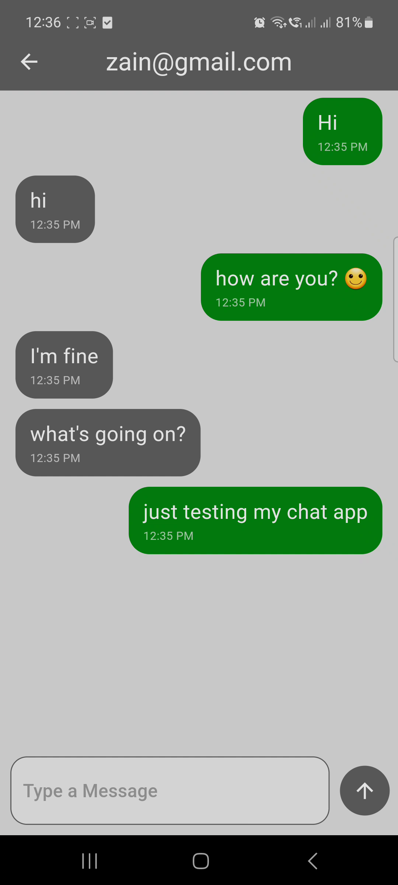
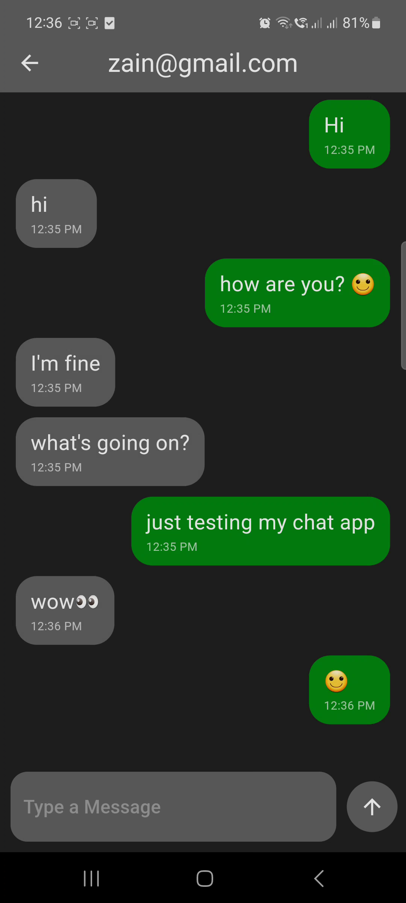
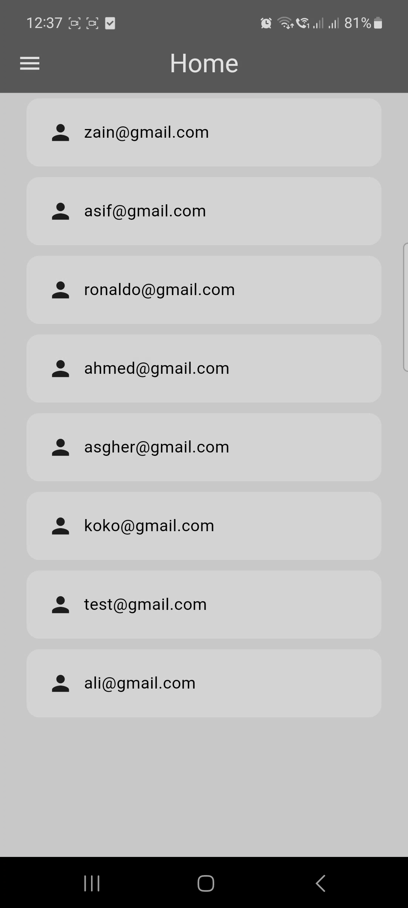
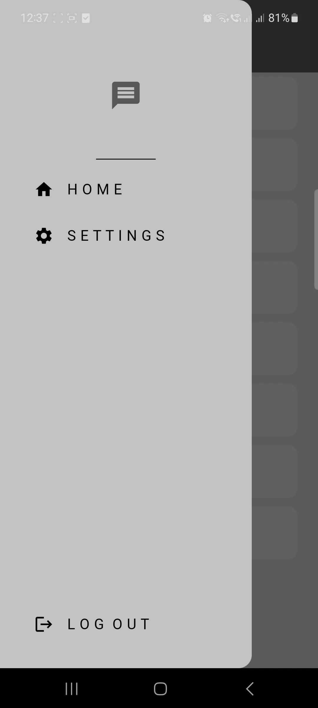
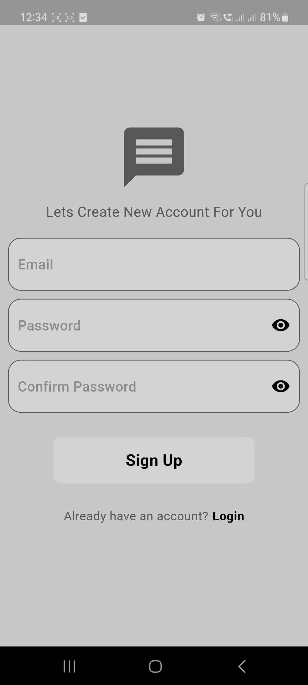
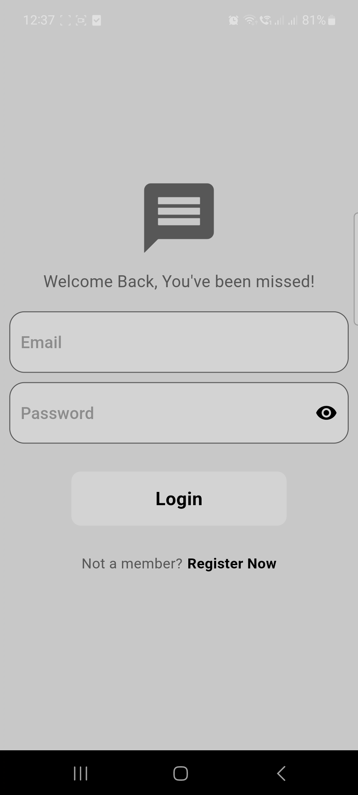

# Flutter Chat App: A Real-Time Messaging Experience:

# Looking for a beautifully designed and functional chat app built with Flutter? Look no further!:

This project offers a seamless real-time messaging experience, perfect for connecting with friends, family, or colleagues.

## Key Features:

###  Minimalist Chat Design: Enjoy a clean and user-friendly interface that prioritizes clear communication.
* **Firebase Integration:** Leverage the power of Firebase for secure user authentication and reliable message storage in the cloud.
* **Seamless Login and Registration:** Easily sign in with existing credentials or create a new account if you're new to the app.
* **User List Management:** View a list of all registered users (except yourself) to find who you want to chat with.
* **Intuitive Navigation:** Navigate between the Home screen, Settings, and Logout options with a convenient drawer menu.
* **Light & Dark Mode:** Switch effortlessly between light and dark themes for a personalized and comfortable viewing experience.
* **Clear Message Display:** Messages are neatly aligned to the right for you and the left for others, with timestamps for clarity.
* **Smooth Scrolling:** Enjoy automatic scrolling to the bottom of the chat list whenever you open a chat or send a new message.
* **Provider-Powered State Management:** Benefit from a well-structured approach to handling state changes within the app.
* **MVVM Clean Architecture:** Navigate a clean and maintainable codebase built using the MVVM architectural pattern.
* **Reusable Components:** Appreciate the use of well-defined components for efficient code reuse.

**Learning Outcomes:**

This project served as a fantastic learning experience, allowing me to:

* Build a fully functional app with clean and well-organized code.
* Integrate Firebase with Flutter to leverage its powerful features.
* Gain a deeper understanding of stateful and stateless widgets in Flutter.
* Master the art of creating reusable UI components for efficient development.
* And much more!

**Getting Started**

1. Clone this repository.
2. Install the required dependencies using `flutter pub get`.
3. Configure your Firebase project and set up your Firebase credentials (refer to Firebase documentation).
4. Run the app using `flutter run`.

## Screenshots

**Feel free to explore the codebase, learn from it, and customize it to your liking!**
